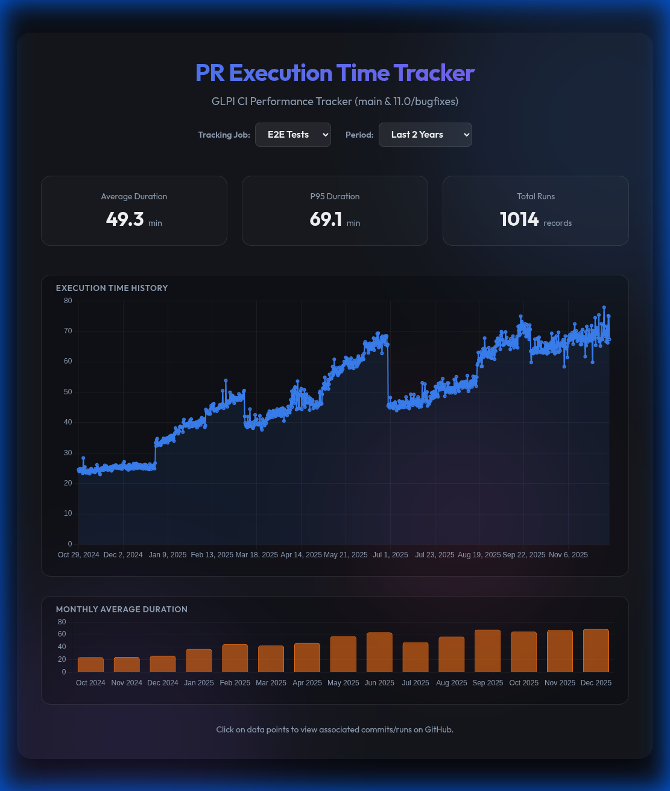

# GLPI CI Performance Tracker

A modern, interactive dashboard to track and visualize the execution time of CI jobs for the `glpi-project/glpi` repository.



## Features

- **Multi-Job Support**: Switch between **PHP Tests** and **E2E Tests**.
- **Historical Analysis**: View up to 2 years of performance data (subject to GitHub retention).
- **Interactive Charts**:
    - **Execution History**: High-resolution line chart with zoom/pan support.
    - **Monthly Averages**: Trend analysis with monthly bar chart.
- **Detailed Context**: Click data points to open the associated GitHub workflow run.

## Prerequisites

- **Node.js**: v18 or higher.
- **GitHub CLI (`gh`)**: Authenticated with `gh auth login`.

## Setup & Run

1.  **Install Dependencies**:
    ```bash
    npm install
    ```

2.  **Fetch Data**:
    The dashboard requires historical data to be fetched from the GitHub API.
    ```bash
    # Fetch initial history (may take a few minutes)
    node fetch_data.js --older
    ```

3.  **Run Locally**:
    Start the development server:
    ```bash
    npm run dev
    ```
    The dashboard will be available at `http://localhost:5173`.

## Maintenance

To keep the data up to date, run the fetcher with the `--newer` flag:
```bash
node fetch_data.js --newer
```
